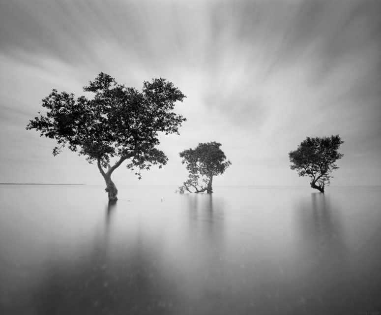

```{=html}
<div style="max-width: 900px; margin: 0 auto; padding: 2rem 2rem 2rem 2rem;">

  <!-- HERO -->
  <div style="display: flex; flex-direction: row; align-items: center; gap: 2.5rem; padding-bottom: 2.5rem; border-bottom: 1px solid #e0e0e0;">
    
    
    
    <div>
     <h1 style="font-size: 2.6rem; font-weight: 300; line-height: 1.1; letter-spacing: -0.02em; color: #1a1a1a; margin: 0 0 0.8rem 0; border: none;">Leo Williams</h1>
      <p style="font-size: 0.95rem; color: #555555; max-width: 44ch; line-height: 1.75; margin-bottom: 1.25rem;">Masters student at UBC in Geomatics for Environmental Management</p>
      <div style="display: flex; gap: 1.5rem; flex-wrap: wrap;">
        <a href="resume.html" style="font-size: 0.75rem; font-weight: 500; letter-spacing: 0.1em; text-transform: uppercase; color: #1a1a1a; border-bottom: 1px solid #1a1a1a; padding-bottom: 2px;">Resume</a>
        <a href="https://www.linkedin.com/in/leo-williams-geospatial/" target="_blank" style="font-size: 0.75rem; font-weight: 500; letter-spacing: 0.1em; text-transform: uppercase; color: #1a1a1a; border-bottom: 1px solid #1a1a1a; padding-bottom: 2px;">LinkedIn</a>
        <a href="https://github.com/leowilliams-01" target="_blank" style="font-size: 0.75rem; font-weight: 500; letter-spacing: 0.1em; text-transform: uppercase; color: #1a1a1a; border-bottom: 1px solid #1a1a1a; padding-bottom: 2px;">GitHub</a>
        <a href="mailto:leo.williams.1122@gmail.com" style="font-size: 0.75rem; font-weight: 500; letter-spacing: 0.1em; text-transform: uppercase; color: #1a1a1a; border-bottom: 1px solid #1a1a1a; padding-bottom: 2px;">Email</a>
      </div>
    </div>
  </div>

  <!-- PROJECTS LABEL -->
  <div style="font-size: 0.72rem; font-weight: 600; letter-spacing: 0.14em; text-transform: uppercase; color: #999999; margin: 2.5rem 0 1.5rem 0;">Selected Projects</div>

  <!-- PROJECT GRID -->
  <div style="display: grid; grid-template-columns: repeat(2, 1fr); gap: 1.5rem; margin-bottom: 4rem;">
    
    <a href="mangrovemapping.html" style="background: #ffffff; border: 1px solid #e0e0e0; border-radius: 2px; overflow: hidden; text-decoration: none; display: block; border-bottom: none;">
      
      <div style="padding: 1rem 1.25rem 1.25rem;">
        <div style="font-size: 0.72rem; font-weight: 500; letter-spacing: 0.1em; text-transform: uppercase; color: #2d5a4e; margin-bottom: 0.3rem;">Remote Sensing · GEE · Random Forest</div>
        <div style="font-size: 0.95rem; font-weight: 500; color: #1a1a1a; margin-bottom: 0.4rem;">Mangrove Mapping & Change Detection</div>
        <p style="font-size: 0.83rem; color: #777777; line-height: 1.6; margin: 0;">Quantifying mangrove dynamics across Guinea-Bissau between 2020 and 2025 using Sentinel-2 imagery and the GEM methodology.</p>
      </div>
    </a>

    <a href="lidarmetrics.html" style="background: #ffffff; border: 1px solid #e0e0e0; border-radius: 2px; overflow: hidden; text-decoration: none; display: block; border-bottom: none;">
      
      <div style="padding: 1rem 1.25rem 1.25rem;">
        <div style="font-size: 0.72rem; font-weight: 500; letter-spacing: 0.1em; text-transform: uppercase; color: #2d5a4e; margin-bottom: 0.3rem;">LiDAR · R · Predictive Modelling</div>
        <div style="font-size: 0.95rem; font-weight: 500; color: #1a1a1a; margin-bottom: 0.4rem;">LiDAR Terrain & Biomass Modelling</div>
        <p style="font-size: 0.83rem; color: #777777; line-height: 1.6; margin: 0;">Building wall-to-wall predictions of above-ground biomass and dominant tree height across the Alex Fraser Research Forest.</p>
      </div>
    </a>

    <a href="lidr_boulders.html" style="background: #ffffff; border: 1px solid #e0e0e0; border-radius: 2px; overflow: hidden; text-decoration: none; display: block; border-bottom: none;">
      
      <div style="padding: 1rem 1.25rem 1.25rem;">
        <div style="font-size: 0.72rem; font-weight: 500; letter-spacing: 0.1em; text-transform: uppercase; color: #2d5a4e; margin-bottom: 0.3rem;">LiDAR · Terrain Analysis · R</div>
        <div style="font-size: 0.95rem; font-weight: 500; color: #1a1a1a; margin-bottom: 0.4rem;">LiDAR Boulder Detection</div>
        <p style="font-size: 0.83rem; color: #777777; line-height: 1.6; margin: 0;">Detecting and characterising boulders from high-resolution LiDAR point clouds in Squamish, BC.</p>
      </div>
    </a>

  </div>
</div>
```