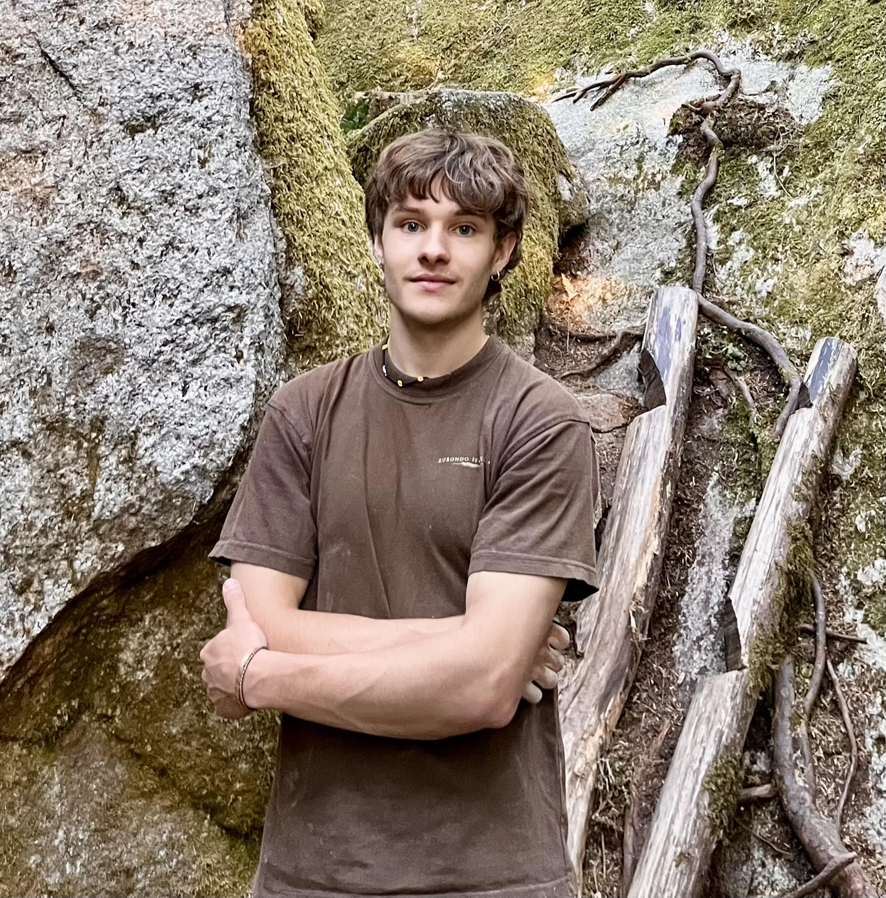
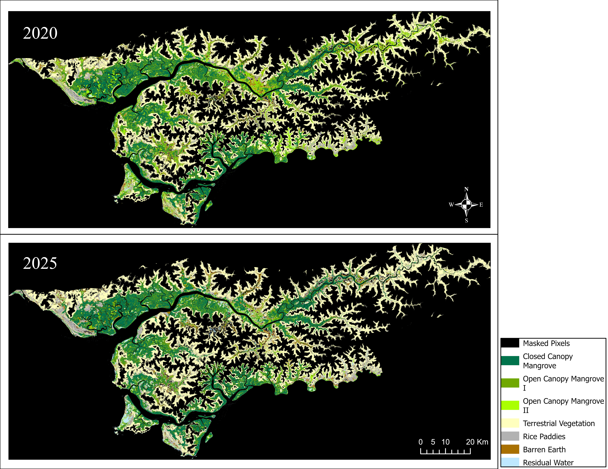
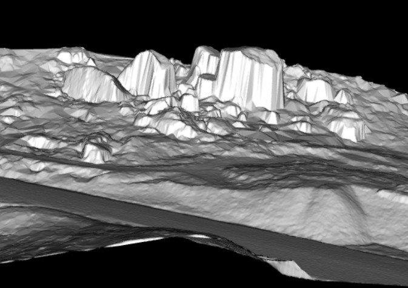

```{=html}
<div class="hero">
  <div class="hero-text">
    <h1>Leo<br><span>Williams</span></h1>
    <p>Master's student in Geomatics for Environmental Management at UBC. I use satellite imagery, LiDAR, and machine learning to understand and protect ecosystems — from mangrove forests in West Africa to old-growth forest in British Columbia.</p>
    <div class="hero-links">
      <a href="resume.html">Resume</a>
      <a href="https://www.linkedin.com/in/leo-williams-geospatial/" target="_blank">LinkedIn</a>
      <a href="https://github.com/leowilliams-01" target="_blank">GitHub</a>
      <a href="mailto:leo.williams.1122@gmail.com">Email</a>
    </div>
  </div>
  <div class="hero-image">
    
  </div>
</div>

<div class="section-label">Selected Projects</div>

<div class="project-grid">
  <a class="project-card" href="mangrovemapping.html">
    
    <div class="project-card-body">
      <div class="project-card-tag">Remote Sensing · GEE · Random Forest</div>
      <div class="project-card-title">Mangrove Mapping & Change Detection</div>
      <p class="project-card-desc">Quantifying mangrove dynamics across Guinea-Bissau between 2020 and 2025 using Sentinel-2 imagery and the GEM methodology.</p>
    </div>
  </a>
  <a class="project-card" href="lidarmetrics.html">
    
    <div class="project-card-body">
      <div class="project-card-tag">LiDAR · R · Predictive Modelling</div>
      <div class="project-card-title">LiDAR Terrain & Biomass Modelling</div>
      <p class="project-card-desc">Building wall-to-wall predictions of above-ground biomass and dominant tree height across the Alex Fraser Research Forest.</p>
    </div>
  </a>
  <a class="project-card" href="lidr_boulders.html">
    
    <div class="project-card-body">
      <div class="project-card-tag">LiDAR · Terrain Analysis · R</div>
      <div class="project-card-title">LiDAR Boulder Detection</div>
      <p class="project-card-desc">Detecting and characterising boulders from high-resolution LiDAR point clouds in Squamish, BC.</p>
    </div>
  </a>
</div>
```