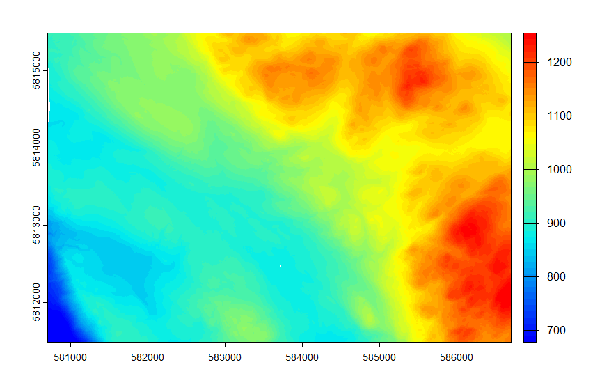
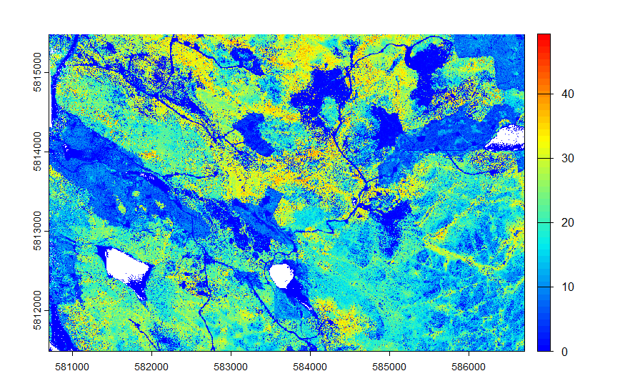
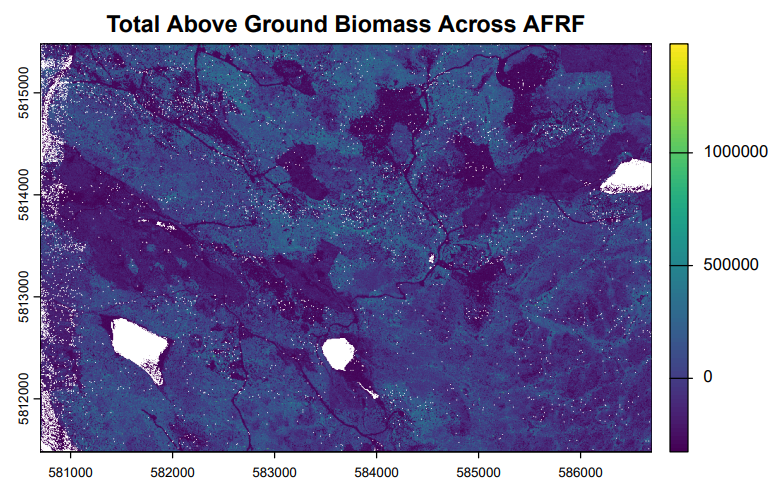
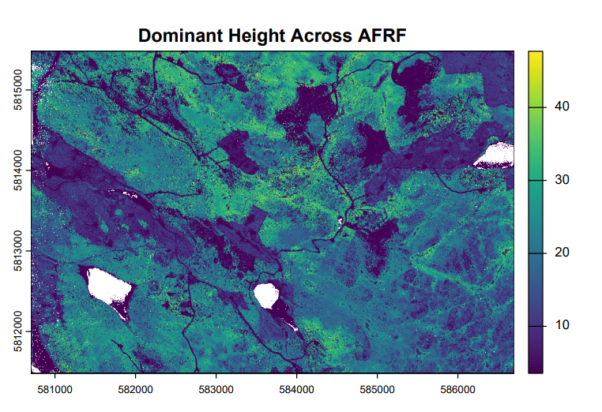

One of the most exciting projects from my Advanced Remote Sensing course from my Masters at UBC. This lab had me working with airborne LiDAR data collected over the Alex Fraser Research Forest (AFRF) in British Columbia. Starting from raw point cloud tiles and finishing with wall-to-wall predictions of forest biomass and tree height across an entire research forest, this workflow pushed my R skills and gave me a real appreciation for just how much information is packed into a LiDAR dataset.

## Overview

LiDAR point clouds capture the three-dimensional structure of a forest in extraordinary detail. This project moves from raw `.las` tiles through terrain and canopy modelling, field plot metric extraction, statistical model fitting, and finally spatially continuous predictions of above-ground biomass (AGB) and dominant tree height across AFRF, all built in R using the `lidR` and `terra` packages.

## Pre-Processing

The first step was reading in the raw LiDAR catalog and cleaning it up. Duplicate points were filtered out and tiles were written to a cleaned output directory before anything else could happen. Nothing glamorous, but getting this right is what makes everything downstream reliable!

```{r, eval=FALSE, echo=TRUE, warning=FALSE, message=FALSE}
library(lidR)
library(terra)
library(tidyverse)

cat_afrf <- readLAScatalog("LAS/")
opt_output_files(cat_afrf) <- "Filtered/filtered_afrf_{ID}"
cat_afrf <- filter_duplicates(cat_afrf)
```

## Terrain & Canopy Modelling

With clean data in hand, the next step was building a Digital Terrain Model (DTM) at 2m resolution using TIN interpolation across all ground returns. This DTM was then used to normalize the point cloud so that all heights are relative to the ground rather than sea level, which is a crucial step before any canopy analysis. After filtering out noise points below 0m and above 55m, a Canopy Height Model (CHM) was generated using the point-to-raster method.

```{r, eval=FALSE, echo=TRUE, warning=FALSE, message=FALSE}
# Generate DTM from ground returns
dem_allLAS_afrf <- rasterize_terrain(filtered_cat_afrf, 2, tin())

# Normalize point heights to ground level
norm_tiles_afrf <- normalize_height(filtered_cat_afrf, dem_allLAS_afrf)

# Remove noise and generate CHM
opt_filter(norm_cat_afrf) <- '-drop_z_below 0 -drop_z_above 55'
chm_afrf <- rasterize_canopy(norm_cat_afrf, 2, p2r())
```

{fig-align="center"}

{fig-align="center"}

## Plot Metrics & Model Fitting

This was the part I found most satisfying. Field plot data provided ground truth measurements of total AGB and dominant tree height across 38 plots. For each plot, a 30m radius clip was extracted from the normalized catalog and standard LiDAR metrics were computed, things like height percentiles, canopy density, and intensity statistics.

Predictor selection followed an iterative process where candidate metrics were first screened for collinearity using pairwise scatterplots, then tested for significance using `add1()` with an F-test. For AGB, `zq95` (95th percentile of point heights) and `zkurt` (kurtosis of the height distribution) came out on top. For dominant height, `zq95` alone turned out to be the cleanest predictor once collinearity between candidates was accounted for. Sometimes simpler really is better!

```{r, eval=FALSE, echo=TRUE, warning=FALSE, message=FALSE}
# AGB model — two predictors
model_AGB <- lm(Total_AGB ~ zq95 + zkurt, data = data_table)

# Dominant height model — zq95 alone wins out
model_domH <- lm(Dominant_Height ~ zq95, data = data_table)
```

$$
\text{Total AGB} = -361{,}904.73 + 15{,}020.66 \times z_{q95} + 35{,}671.60 \times z_{kurt}
$$

$$
R^2 = 0.469 \qquad R^2_{\text{adj}} = 0.439
$$

$$
\text{Dominant Height} = 3.555 + 0.910 \times z_{q95}
$$

$$
R^2 = 0.703 \qquad R^2_{\text{adj}} = 0.695
$$

The dominant height model landed a really solid R² of 0.70 with just a single predictor, which speaks to how well upper canopy height percentiles capture actual tree height in a structurally complex forest.

## Wall-to-Wall Predictions

The final step was scaling both models up to cover all of AFRF. Pixel-level LiDAR metrics were computed at 2m resolution across the full normalized catalog, the relevant predictor layers were extracted as rasters, and the model equations were applied using `terra::app()`.

```{r, eval=FALSE, echo=TRUE, warning=FALSE, message=FALSE}
# Compute pixel-level metrics at 2m resolution
pixel_metrics_afrf <- pixel_metrics(norm_cat_afrf, .stdmetrics, 2)

# Extract predictor rasters
zq95_afrf <- terra::subset(pixel_metrics_afrf, "zq95")
zkurt_afrf <- terra::subset(pixel_metrics_afrf, "zkurt")

# Apply model functions wall-to-wall
total_biomass <- function(x){ -361904.73 + 15020.66*x[1] + 35671.60*x[2] }
dominant_h <- function(x){ 3.5554418 + 0.9101865*x }

total_AGB_afrf <- terra::app(c(zq95_afrf, zkurt_afrf), total_biomass)
dominant_h_afrf <- terra::app(zq95_afrf, dominant_h)
```

{fig-align="center"}

{fig-align="center"}
