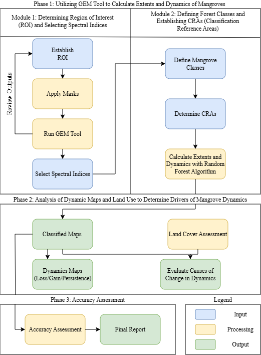
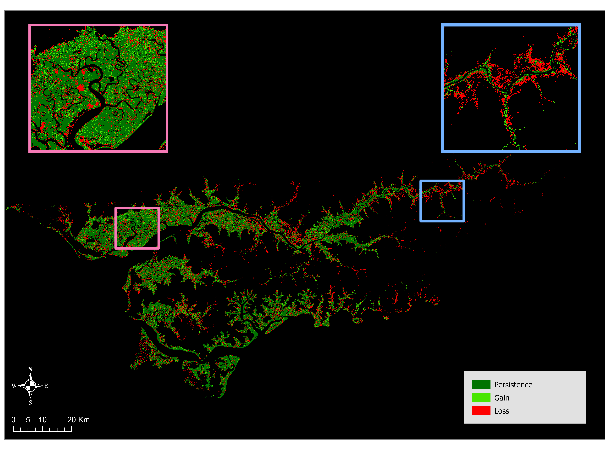
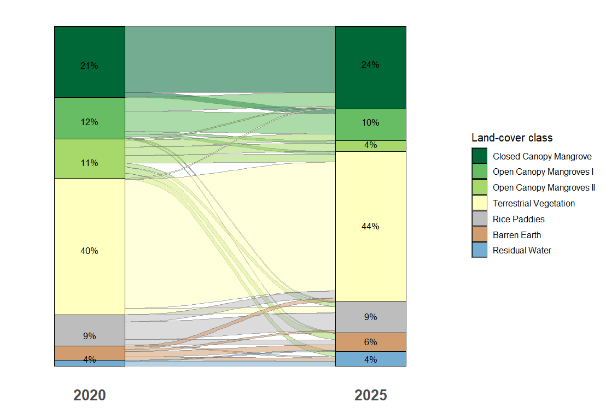
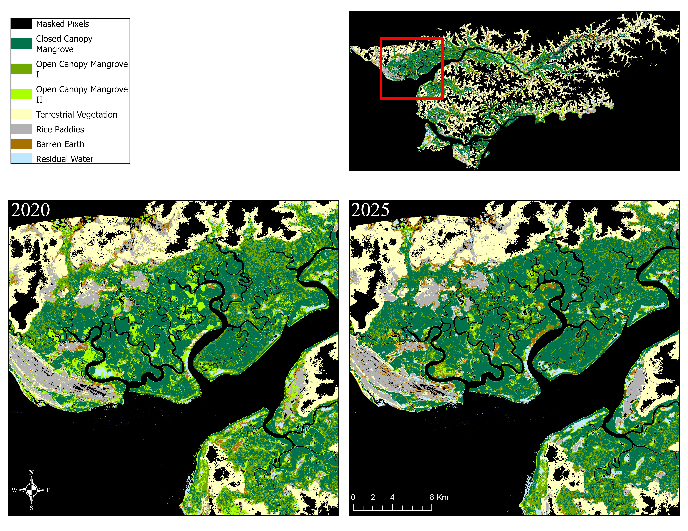
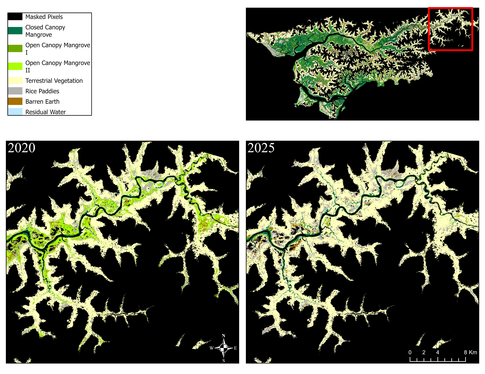

This research project began in the Autumn of 2025 and will be completed in the Spring of 2026. The research was my main project for my masters program at the University of British Columbia and done in association with Blue Ventures.

## Abstract

Mangroves are among the most ecologically and climatically significant ecosystems on Earth, yet they remain under persistent threat from both anthropogenic pressure and environmental change. This study quantifies mangrove dynamics across the Cacheu region of northern Guinea-Bissau between 2020 and 2025, using the Google Earth Engine Mangrove Mapping Methodology (GEM) applied to Sentinel-2 satellite imagery. Seven land cover classes were mapped using a Random Forest classifier, and dynamics of loss, gain, and persistence were assessed across the study period. Results reveal a net decline in total mangrove extent of 13.23%, from 123,375 ha to 107,047 ha, driven primarily by losses along mangrove margins in the eastern sub-region. Conversely, the western sub-region exhibited signs of canopy densification, with widespread transitions from open to closed canopy classes. Land cover transition analysis suggests that mangrove loss is linked to both conversion for rice paddy agriculture and exposure of barren earth, while mangrove gain is sourced largely from recovering terrestrial vegetation. Both classified maps exceeded the 90% accuracy threshold, with overall accuracies of 97.51% (2020) and 95.22% (2025).

## Methods

Mangrove dynamics across the Cacheu region were assessed using a three-phase methodology built around the Google Earth Engine Mangrove Mapping Methodology (GEM). In Phase 1, pre-processing began by defining a region of interest (ROI) along the coastal zone of northern Guinea-Bissau, applying a 20 km inland buffer to capture the full mangrove extent, and applying topographic and water masks to exclude non-relevant areas. Six spectral indices derived from dry-season Sentinel-2 imagery (January to February, 2020 and 2025) were then selected for classification, including NDVI, MNDWI, CMRI, SAVI, LSWI, and MMRI. Seven land cover classes were defined: Closed Canopy Mangrove (CCM), Open Canopy Mangrove I (OCM I, 30 to 60% canopy cover), Open Canopy Mangrove II (OCM II, less than 30% canopy cover), Terrestrial Vegetation, Rice Paddies, Barren/Exposed, and Residual Water. Classification Reference Areas (CRAs) were then established as training data for a Random Forest classifier run through Google Earth Engine.

Phase 2 identified the drivers of observed dynamics through a land cover transition analysis and a spatial distribution analysis of the resulting dynamics maps. The Sankey diagram was used to trace flows between land cover classes across the two time steps, while spatial patterns of gain, loss, and persistence were examined through visual interpretation of two sub-regions (western and eastern Cacheu) and cross-referenced with transition data. Phase 3 assessed classification accuracy using the 30% of CRAs withheld from the Random Forest algorithm. Maps falling below a 90% accuracy threshold were revised until the threshold was met.

{fig-align="center"}

## Results

Classification of Sentinel-2 imagery produced land cover maps for 2020 and 2025 (Figure 2), revealing a net mangrove decline of 13.23%, from 123,375 ha (44% of the ROI) in 2020 to 107,047 ha (38%) in 2025. Of the 2020 mangrove extent, 69.07% persisted through to 2025, while 30.93% was lost and 17.69% was gained as new mangrove area. Closed Canopy Mangrove expanded from 21% to 24% of the ROI, while both open canopy classes declined, with OCM I falling from 12% to 10% and OCM II from 11% to just 4%. Terrestrial vegetation, rice paddies, and residual water remained broadly stable, while barren earth increased from 4% to 6%.

The land cover transition analysis (Figure 4) shows that the dominant transition across the study period was from OCM II to terrestrial vegetation, concentrated heavily in the eastern sub-region, where losses followed the ends of the riparian mangrove network with little evidence of recovery (Figures 3 and 6). In contrast, the western sub-region exhibited canopy densification, with a broad shift from open to closed canopy classes suggesting forest recovery rather than areal expansion (Figure 5). Mangrove gains were primarily sourced from terrestrial vegetation (900 ha) and rice paddies (402 ha), pointing to natural regeneration and possible agricultural abandonment as recovery mechanisms. Both classified maps exceeded the 90% accuracy threshold, achieving overall accuracies of 97.51% (Kappa: 0.97) in 2020 and 95.22% (Kappa: 0.94) in 2025.

{fig-align="center" width="100%"}

{fig-align="center" width="100%"}

{fig-align="center" width="90%"}

{fig-align="center" width="100%"}

{fig-align="center" width="100%"}

## References

*AW3D30 DSM data map*. (n.d.). Retrieved October 9, 2025, from https://www.eorc.jaxa.jp/ALOS/en/aw3d30/data/index.htm

Basyuni, M., Sasmito, S. D., Analuddin, K., Ulqodry, T. Z., Saragi-Sasmito, M. F., Eddy, S., & Milantara, N. (2022a). Mangrove Biodiversity, Conservation and Roles for Livelihoods in Indonesia. In S. C. Das, Pullaiah, & E. C. Ashton (Eds.), *Mangroves: Biodiversity, Livelihoods and Conservation* (pp. 397–445). Springer Nature. https://doi.org/10.1007/978-981-19-0519-3_16

Basyuni, M., Sasmito, S. D., Analuddin, K., Ulqodry, T. Z., Saragi-Sasmito, M. F., Eddy, S., & Milantara, N. (2022b). Mangrove Biodiversity, Conservation and Roles for Livelihoods in Indonesia. In S. C. Das, Pullaiah, & E. C. Ashton (Eds.), *Mangroves: Biodiversity, Livelihoods and Conservation* (pp. 397–445). Springer Nature. https://doi.org/10.1007/978-981-19-0519-3_16

Breiman, L. (2001). Random Forests. *Machine Learning*, *45*(1), 5–32. https://doi.org/10.1023/A:1010933404324

Bunting, P., Rosenqvist, A., Lucas, R. M., Rebelo, L.-M., Hilarides, L., Thomas, N., Hardy, A., Itoh, T., Shimada, M., & Finlayson, C. M. (2018). The Global Mangrove Watch—A New 2010 Global Baseline of Mangrove Extent. *Remote Sensing*, *10*(10). https://doi.org/10.3390/rs10101669

Chandrasekar, K., Sesha Sai, M. V. R., Roy, P. S., & Dwevedi, R. S. (2010). Land Surface Water Index (LSWI) response to rainfall and NDVI using the MODIS Vegetation Index product. *International Journal of Remote Sensing*, *31*(15), 3987–4005. https://doi.org/10.1080/01431160802575653

*Copernicus Browser*. (n.d.). Copernicus Browser. Retrieved October 9, 2025, from https://browser.dataspace.copernicus.eu/

de Almeida, A. M., & Cardoso, L. A. (2008). Animal production and genetic resources in Guinea Bissau: I – Northern Cacheu Province. *Tropical Animal Health and Production*, *40*(7), 529–536. https://doi.org/10.1007/s11250-008-9130-9

Diniz, C., Cortinhas, L., Nerino, G., Rodrigues, J., Sadeck, L., Adami, M., & Souza-Filho, P. W. M. (2019). Brazilian Mangrove Status: Three Decades of Satellite Data Analysis. *Remote Sensing*, *11*(7), 808. https://doi.org/10.3390/rs11070808

Gandhi, S., & Jones, T. G. (2019). Identifying Mangrove Deforestation Hotspots in South Asia, Southeast Asia and Asia-Pacific. *Remote Sensing*, *11*(6), 728. https://doi.org/10.3390/rs11060728

Garbanzo, G., Cameira, M. do R., & Paredes, P. (2024). The Mangrove Swamp Rice Production System of Guinea Bissau: Identification of the Main Constraints Associated with Soil Salinity and Rainfall Variability. *Agronomy*, *14*(3), 468. https://doi.org/10.3390/agronomy14030468

*GEM Desktop Best Practice Guidance Doc v2.0 (Jan 2025)*. (n.d.). Google Docs. Retrieved October 7, 2025, from https://docs.google.com/document/d/1_HJA0LNglWBEiHLMPnky9UbKcyLBW-BUi8aNnkb0E60/edit?tab=t.0&usp=embed_facebook

Giri, C., Ochieng, E., Tieszen, L. L., Zhu, Z., Singh, A., Loveland, T., Masek, J., & Duke, N. (2011). Status and distribution of mangrove forests of the world using earth observation satellite data. *Global Ecology and Biogeography*, *20*(1), 154–159. https://doi.org/10.1111/j.1466-8238.2010.00584.x

*Global Intertidal Change—Direct Download*. (n.d.). Retrieved October 9, 2025, from https://www.intertidal.app/download/direct-download

*Global Mangrove Watch*. (n.d.). Retrieved October 9, 2025, from https://www.globalmangrovewatch.org/?bounds=\[\[-88.45312714576907,-56.62130010057423\],\[88.45312714576619,73.27539824869464\]\]

Gupta, K., Mukhopadhyay, A., Giri, S., Chanda, A., Datta Majumdar, S., Samanta, S., Mitra, D., Samal, R. N., Pattnaik, A. K., & Hazra, S. (2018). An index for discrimination of mangroves from non-mangroves using LANDSAT 8 OLI imagery. *MethodsX*, *5*, 1129–1139. https://doi.org/10.1016/j.mex.2018.09.011

Huete, A., Didan, K., Leeuwen, W. V., Jacobson, A., Solanos, R., & Laing, T. (n.d.). *1The University of Arizona*.

Jayanthi, M., Thirumurthy, S., Nagaraj, G., Muralidhar, M., & Ravichandran, P. (2018). Spatial and temporal changes in mangrove cover across the protected and unprotected forests of India. *Estuarine, Coastal and Shelf Science*, *213*, 81–91. https://doi.org/10.1016/j.ecss.2018.08.016

Jones, T. G., Glass, L., Gandhi, S., Ravaoarinorotsihoarana, L., Carro, A., Benson, L., Ratsimba, H. R., Giri, C., Randriamanatena, D., & Cripps, G. (2016). Madagascar’s mangroves: Quantifying nation-wide and ecosystem specific dynamics, and detailed contemporary mapping of distinct ecosystems. *Remote Sensing*, *8*(2), 106.

Leong, R. C., Friess, D. A., Crase, B., Lee, W. K., & Webb, E. L. (2018). High-resolution pattern of mangrove species distribution is controlled by surface elevation. *Estuarine, Coastal and Shelf Science*, *202*, 185–192. https://doi.org/10.1016/j.ecss.2017.12.015

Malik, A., Fensholt, R., & Mertz, O. (2015). Mangrove exploitation effects on biodiversity and ecosystem services. *Biodiversity and Conservation*, *24*(14), 3543–3557. https://doi.org/10.1007/s10531-015-1015-4

Mituro, F. (2025a). *Comparison Between Sentinel-2 and Landsat in Mapping Mangroves in The Gambia Using the Google Earth Engine Mangrove Mapping Methodology (GEM v2)* \[Dataset\]. Borealis. https://doi.org/10.5683/SP3/UNZTIH

Mituro, F. (2025b). *Comparison Between Sentinel-2 and Landsat in Mapping Mangroves in The Gambia Using the Google Earth Engine Mangrove Mapping Methodology (GEM v2)* \[Dataset\]. Borealis. https://doi.org/10.5683/SP3/UNZTIH

Romañach, S. S., DeAngelis, D. L., Koh, H. L., Li, Y., Teh, S. Y., Raja Barizan, R. S., & Zhai, L. (2018). Conservation and restoration of mangroves: Global status, perspectives, and prognosis. *Ocean & Coastal Management*, *154*, 72–82. https://doi.org/10.1016/j.ocecoaman.2018.01.009

Sayre, R., Noble, S., Hamann, S. L., Smith, R. A., Wright, D. J., Breyer, S. P., Butler, K., Graafeiland, K. V., Frye, C., Karagulle, D., Hopkins, D., Stephens, D., Kelly, K., Basher, Z., Burton, D., Cress, J. J., Atkins, K., Sistine, D. P. V., Friesen, B., … Reed, A. (2019). A new 30 meter resolution global shoreline vector and associated global islands database for the development of standardized ecological coastal units. *Journal of Operational Oceanography*, *12*(suppl 2), s47–s56. https://doi.org/10.1080/1755876X.2018.1529714

Tarpley, J. D., Schneider, S. R., & Money, R. L. (1984). *Global Vegetation Indices from the NOAA-7 Meteorological Satellite*. https://journals.ametsoc.org/view/journals/apme/23/3/1520-0450_1984_023_0491_gviftn_2_0_co_2.xml

Temudo, M. P., & Cabral, A. I. (2017). The Social Dynamics of Mangrove Forests in Guinea-Bissau, West Africa. *Human Ecology*, *45*(3), 307–320. https://doi.org/10.1007/s10745-017-9907-4

Tessema, B. Y. (2025). *Monitoring Mangrove Recovery in the Bay of Assassins, Madagascar: Using Sentinel-2 Imagery and the Google Earth Mangrove Mapping Methodology (GEM)* (Version 1.0, pp. 468359092, 5458, 12898670, 4633, 765711, 10032, 13843957, 65696, 2538880, 7359) \[Application/zip,application/zipped-shapefile,application/zip,application/zip,application/zip,application/zip,application/zip,application/zip,application/pdf,text/plain\]. Borealis. https://doi.org/10.5683/SP3/TCRSVH

Thakur, S., Mondal, I., Ghosh, P. B., Das, P., & De, T. K. (2020). A review of the application of multispectral remote sensing in the study of mangrove ecosystems with special emphasis on image processing techniques. *Spatial Information Research*, *28*(1), 39–51. https://doi.org/10.1007/s41324-019-00268-y

Thomas, N., Bunting, P., Lucas, R., Hardy, A., Rosenqvist, A., & Fatoyinbo, T. (2018). Mapping Mangrove Extent and Change: A Globally Applicable Approach. *Remote Sensing*, *10*(9), 1466. https://doi.org/10.3390/rs10091466

Xu, H. (2006). Modification of normalised difference water index (NDWI) to enhance open water features in remotely sensed imagery. *International Journal of Remote Sensing*, *27*(14), 3025–3033. https://doi.org/10.1080/01431160600589179

Yancho, J. M. M., Jones, T. G., Gandhi, S. R., Ferster, C., Lin, A., & Glass, L. (2020). The Google Earth Engine Mangrove Mapping Methodology (GEEMMM). *Remote Sensing*, *12*(22), 3758. https://doi.org/10.3390/rs12223758

Zhao, S. (2023). *Mangrove mapping along the Lower Casamance River in Senegal, using the Google Earth Engine Mangrove Mapping Methodology (GEEMMM)* (Version 1.0, pp. 420241747, 2277043, 6632, 4688, 382905, 8839, 1245684) \[Application/zip,application/zip,application/zip,application/zipped-shapefile,application/zip,text/plain,application/pdf\]. Borealis. https://doi.org/10.5683/SP3/UA19NL
