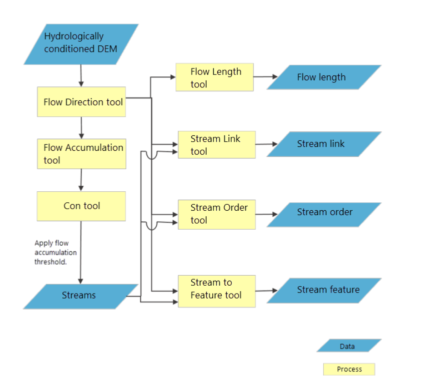
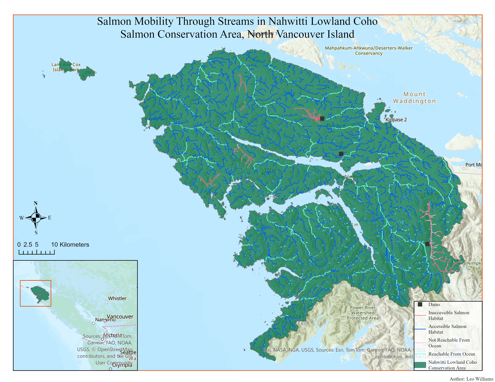

This project was completed as part of my Advanced GIS course at UBC. The goal was to model a stream network for Vancouver Island from a digital elevation model and use it to identify accessible salmon spawning habitat, taking into account dams as barriers to upstream migration. It was a great exercise in combining raster hydrology, network topology, and linear referencing into one end-to-end workflow.

## Overview

Pacific salmon are diadromous, spending their lives between the ocean and freshwater, returning to spawn in the same streams where they were born. Identifying where salmon can actually reach is therefore a real conservation question, and one that GIS is well suited to answer. This project focuses on Vancouver Island, using ArcGIS Pro to derive a stream network from a DEM, model dams as movement barriers, and evaluate stream segments against basic habitat criteria for spawning suitability.

## Methods

The workflow began with a pre-processed 25m DEM of Vancouver Island. Flow direction and flow accumulation rasters were derived from the DEM, and a threshold of 1,000 contributing pixels was used to define the stream network. Stream links and stream order were calculated across the island, and the raster streams were converted to polyline features.

{fig-align="center" width="100%"}

*Figure 1 – Diagram of Hydrological Analysis done in this Workflow.*

Stream polylines were then converted to routes and loaded into a geodatabase feature dataset alongside a dam layer sourced from the BC Government. Network topology was used to identify two sets of junction points: where dams intersect stream routes, and where streams reach the ocean boundary. These junctions were used to parameterise a trace network, which was run from ocean entry points upstream, with dams acting as hard barriers. This produced a classification of stream segments into reachable and impeded reaches.

Slope and stream order attributes were recorded along each route using linear referencing, and an overlay of the two event tables produced a single attribute table covering gradient and order for every stream segment. A final query identified accessible salmon habitat as segments that were reachable from the ocean, were first or second order streams, and had a gradient below 20%.

## Results

{fig-align="center" width="100%"}

*Figure 2 – Map highlighting salmon river mobility in the Nahwitti Lowland Coho Salmon Conservation Area.*

The final map shows stream routes symbolised by reachability, dam barrier locations, and the distribution of accessible versus inaccessible salmon habitat segments across the selected conservation unit. Accessible habitat is concentrated along lower order tributaries near the coast, while dams fragment connectivity across several major river systems.

## Reflection

What I found most interesting about this lab was how much information you can extract from a single elevation raster. Flow direction, accumulation, slope, stream order, and network connectivity are all extracted from one input. The topology workflow for snapping dam and ocean junctions to stream routes was sensitive to error and caused me some headaches along the way, but the logic behind it made sense once it clicked.

## 
